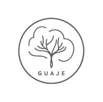

  
  <h1 style="text-align:center;">Guaje Mates</h1>

Proyecto final para el curso de desarrollo web de Coderhouse.

Para acceder a la página hacé click [acá](https://ernedainesi.github.io/guaje-mates/)
